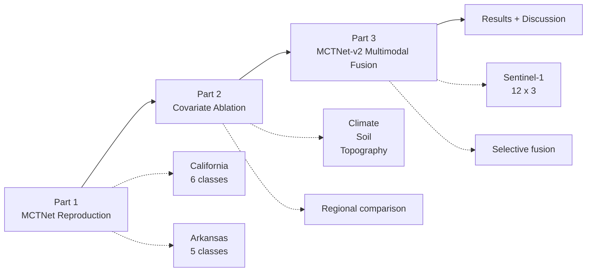
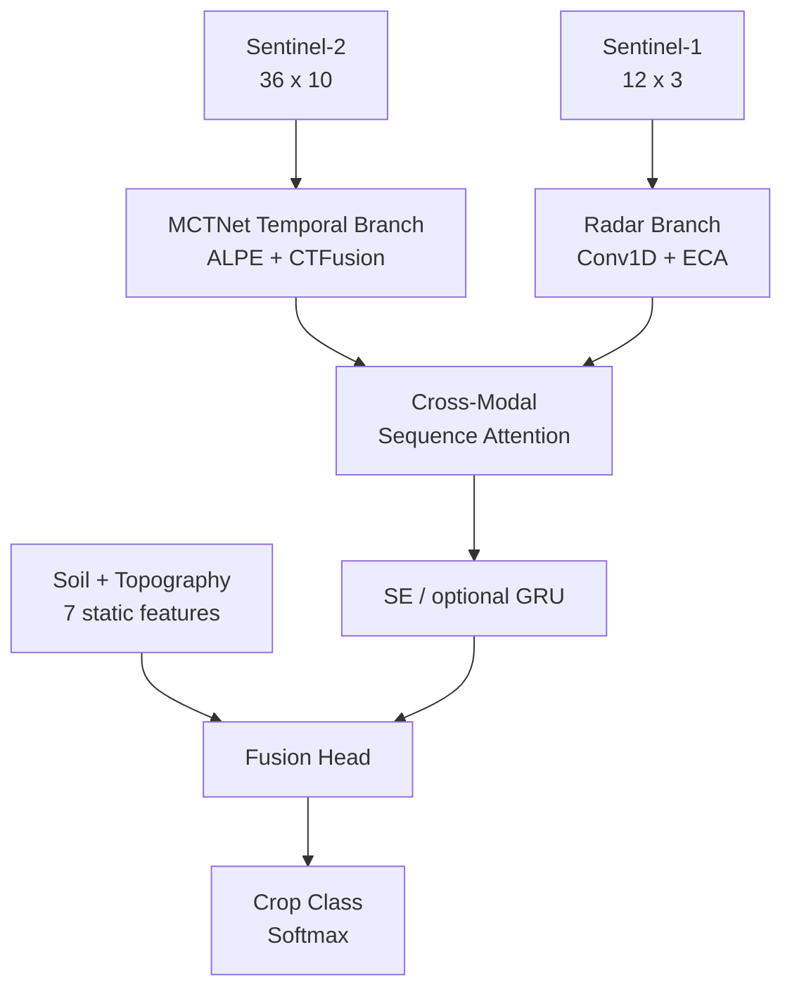
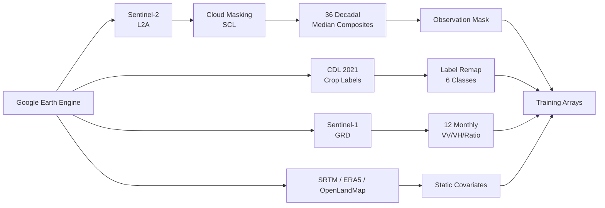

# 🌾 MCTNet Crop Classification

> Lightweight CNN-Transformer models for pixel-based crop mapping from Sentinel-2 time series, with Sentinel-1 radar fusion and environmental covariates.


This repository contains a full academic project around **MCTNet**, a lightweight hybrid **CNN + Transformer** architecture for crop classification using irregular satellite time series. The work reproduces the original MCTNet baseline on **California**, transfers the same pipeline to **Arkansas**, studies environmental covariates in both settings, and proposes **MCTNet-v2**, a multimodal extension combining Sentinel-2, Sentinel-1, soil, and topography.

---

## ✨ What Is Inside?

- 🛰️ **Sentinel-2 temporal classification** with 36 decadal composites and 10 spectral bands.
- ☁️ **Cloud-aware temporal masking** to handle missing observations safely.
- 🧠 **CNN-Transformer hybrid architecture** with ALPE positional encoding and CTFusion blocks.
- 📊 **Ablation study** on climate, soil, and topographic covariates.
- 📡 **MCTNet-v2 multimodal model** using Sentinel-1 radar and cross-modal sequence attention.
- 🧪 **California + Arkansas experiments** for reproduction, extension, and generalization.
- 📝 **Experiment summaries** with figures, tables, architecture diagrams, and final discussion.

---

## 🧭 Project Roadmap



| Phase | Goal | Main Output |
|---|---|---|
| **Part 1** | Reproduce MCTNet on California and transfer it to Arkansas | CA OA **85.15%**, AR OA **91.82%** |
| **Part 2** | Measure climate, soil, and topography contributions by region | Soil/topo help CA; AR stays strongest with S2 |
| **Part 3** | Propose MCTNet-v2 with S2 + S1 + selective static fusion | CA final OA **86.35%**; AR-compatible modules |
| **Discussion** | Compare why the two regions behave differently | California needs extra context; Arkansas is phenology-driven |

---

## 🏗️ Model Architecture

### 1. Baseline MCTNet

MCTNet is a compact temporal classifier designed for sparse Sentinel-2 sequences.


**Core ideas**

- 🧩 **ALPE**: positional encoding conditioned by valid observations.
- ⚡ **CTFusion**: parallel CNN and Transformer branches fused at each stage.
- 🛡️ **Masked attention**: invalid timesteps cannot corrupt the sequence.
- 🌫️ **Temporal dropout**: simulates additional cloud coverage during training.

---

### 2. Proposed MCTNet-v2

MCTNet-v2 extends the baseline with Sentinel-1 radar and selective environmental features.



**Why it helps**

- 📡 Sentinel-1 is less affected by clouds and captures radar texture, moisture, and flooding patterns.
- 🔁 Cross-attention aligns 36 Sentinel-2 timesteps with 12 Sentinel-1 monthly composites.
- 🌱 Soil and topography add useful context in California, while Arkansas is mainly driven by Sentinel-2 phenology.
- 🧊 Climate summaries were excluded from the final model because annual ERA5 averages were too homogeneous in this setup.

---

## 🗂️ Repository Architecture

```text
.
├── california/                         # Main California experiment
│   ├── build_labels_from_cdl.py        # CDL label remapping
│   ├── GEE_California_Sentinel2.js     # Sentinel-2 sampling/export script
│   ├── GEE_Export_Map_ROI.js           # ROI/map export utilities
│   ├── gee_dataset_preparation_california.py
│   ├── mctnet_model_paper.py           # Baseline MCTNet reproduction
│   ├── prepare_dataset.py              # S2 preprocessing and paper-style split
│   ├── prepare_dataset_multimodal.py   # Multimodal preparation helpers
│   ├── run_eda_preprocessing.py        # EDA plots and preprocessing checks
│   ├── Step5_Model_Implementation_MCTNet.ipynb
│   └── partie3/                        # MCTNet-v2 multimodal extension
│       ├── __init__.py
│       ├── dataset_audit.py            # Dataset integrity checks
│       ├── debug_shapes.py             # Shape/debug helper
│       ├── gee_s1_preparation.py       # Sentinel-1 preparation
│       ├── mctnet_v2_model.py          # Proposed S2 + S1 + static architecture
│       ├── multimodal_data.py          # S2/S1/static alignment by id
│       ├── paper_dataset.py            # Paper-style split helpers
│       ├── Partie3_MultiModal_Classification.ipynb
│       ├── run_partie3_ablation.py     # Multimodal ablation launcher
│       ├── s2_decadal_composites.py    # S2 composite builder
│       ├── s2_pixel_streaming.py       # Pixel streaming utilities
│       ├── temporal_regularization.py  # Time-series regularization helpers
│       └── train_ablation.py           # Part 3 training utilities
│
├── Arkanssas/                          # Arkansas transfer/generalization study
│   ├── README.md
│   ├── requirements.txt
│   ├── export_points_from_mctnet_areas.py
│   ├── gee_dataset_preparation.py
│   ├── build_s2_training_arrays.py
│   ├── mctnet_model.py
│   ├── training_utils.py
│   ├── notebooks/                      # Arkansas baseline notebook
│   └── partie3/                        # Arkansas multimodal utilities
│       ├── dataset_audit.py
│       ├── debug_shapes.py
│       ├── gee_s1_preparation.py
│       ├── mctnet_v2_model.py
│       ├── multimodal_data.py
│       ├── paper_dataset.py
│       ├── Partie3_MultiModal_Classification.ipynb
│       ├── s2_decadal_composites.py
│       ├── s2_pixel_streaming.py
│       ├── temporal_regularization.py
│       └── train_ablation.py
│
└── README.md
```

> Large local artifacts are intentionally **not part of the GitHub tree**: datasets, GEE CSV exports, NumPy arrays, trained weights, rasters, generated plots, PDFs, and report/build outputs are ignored through `.gitignore`.

---

## 🛰️ Data Pipeline



### Data Sources

| Source | Use | Shape / Features |
|---|---|---|
| **Sentinel-2 L2A** | Optical time series | 36 timesteps x 10 bands |
| **Sentinel-1 GRD** | Radar time series | 12 months x VV, VH, VH-VV |
| **CDL 2021** | Crop labels | Grapes, Rice, Alfalfa, Almonds, Pistachios, Others |
| **SRTM** | Topography | elevation, slope, aspect |
| **OpenLandMap** | Soil | clay, sand, silt, pH |
| **ERA5-Land** | Climate ablation | annual max/min temperature, precipitation |

---

## 📈 Results

### California Summary

| Model | OA | κ | F1 Macro | Params | Notes |
|---|---:|---:|---:|---:|---|
| Paper reference | 0.8520 | 0.8060 | 0.8290 | - | Wang et al. 2024 |
| **MCTNet reproduction** | **0.8515** | **0.8063** | 0.8040 | 248k | Faithful baseline |
| MCTNet + soil | 0.8417 | 0.8100 | 0.8444 | 251k | Best static ablation |
| MCTNet + topography | 0.8389 | 0.8067 | 0.8384 | 251k | Helpful |
| MCTNet + all covariates | 0.7806 | 0.7367 | 0.7826 | 257k | Overfits |
| **MCTNet-v2 S2 + S1 + soil + topo** | **0.8635** | **0.8230** | **0.8595** | **313k** | Final proposed model |

### Class-Level Gains

| Class | Baseline F1 | MCTNet-v2 F1 | Gain |
|---|---:|---:|---:|
| Grapes | 0.872 | 0.892 | +0.020 |
| Rice | 0.884 | 0.908 | +0.024 |
| Alfalfa | 0.774 | 0.812 | +0.038 |
| Almonds | 0.755 | 0.821 | +0.066 |
| Pistachios | 0.689 | 0.779 | +0.090 |
| Others | 0.851 | 0.864 | +0.013 |

### Key Findings

- ✅ The MCTNet reproduction matches the reference OA and κ almost exactly.
- 🌽 Arkansas confirms that the same MCTNet pipeline transfers well to a second crop system.
- 🌱 Soil features are the most useful static covariates in California.
- 🗺️ Topography also helps in California, especially for geographic separation of crop zones.
- 🌦️ Annual climate summaries are weak in this setup and can degrade performance.
- 📡 Sentinel-1 improves robustness under simulated missing Sentinel-2 observations.
- 🥇 MCTNet-v2 improves macro F1 most strongly for **Pistachios** and **Almonds**.

### Arkansas Summary

| Model | OA | κ | F1 Macro | Notes |
|---|---:|---:|---:|---|
| **MCTNet S2 baseline** | **0.9182** | **0.8977** | **0.9183** | Strong Sentinel-2 phenology |
| MCTNet S2 ablation run | 0.9100 | - | - | Controlled shorter run |
| MCTNet + climate | 0.9020 | - | - | No gain |
| MCTNet + topography | 0.9030 | - | - | No gain |

---

## 🚀 Quick Start

### 1. Create an environment

```bash
python -m venv .venv
source .venv/bin/activate
pip install -r Arkanssas/requirements.txt
```

> The project currently stores the dependency file under `Arkanssas/requirements.txt`. The California scripts use the same core scientific stack: TensorFlow, NumPy, pandas, scikit-learn, matplotlib, and geospatial helpers.

### 2. Export data from Google Earth Engine

Open the GEE scripts in the Earth Engine Code Editor and export the required CSV files:

```text
california/GEE_California_Sentinel2.js
california/GEE_Export_Map_ROI.js
```

### 3. Prepare Sentinel-2 arrays

```bash
cd california
python prepare_dataset.py
python run_eda_preprocessing.py
```

### 4. Train the baseline and Part 2 ablations

Open and run:

```text
california/Step5_Model_Implementation_MCTNet.ipynb
```

### 5. Train MCTNet-v2

```bash
cd california/partie3
python run_partie3_ablation.py
```

Or use the notebook:

```text
california/partie3/Partie3_MultiModal_Classification.ipynb
```

## 🧪 Arkansas Study

The Arkansas folder is the second study area, not just a side note. It tests whether the Sentinel-2 pipeline remains strong on a different crop system with five classes: Corn, Cotton, Soybean, Rice, and Others.

```text
Arkanssas/
├── gee_dataset_preparation.py
├── build_s2_training_arrays.py
├── mctnet_model.py
├── training_utils.py
└── notebooks/
```

Main reported result:

| Study Area | Model | OA | F1 Macro |
|---|---|---:|---:|
| Arkansas | MCTNet S2 baseline | **91.82%** | **91.83%** |

---

## 📚 References

- Wang et al., **A Lightweight CNN-Transformer Network for Pixel-Based Crop Mapping Using Sentinel-2 Time Series**, 2024.
- Vaswani et al., **Attention Is All You Need**, NeurIPS 2017.
- Wang et al., **ECA-Net: Efficient Channel Attention for Deep Convolutional Neural Networks**, CVPR 2020.
- Hu et al., **Squeeze-and-Excitation Networks**, CVPR 2018.
- Russwurm and Korner, **Self-Attention for Raw Optical Satellite Time Series Classification**, ISPRS Journal 2020.
- Gorelick et al., **Google Earth Engine: Planetary-scale Geospatial Analysis for Everyone**, Remote Sensing of Environment 2017.

---

## 👥 Authors

Project developed for **Master 1 SII - USTHB, Faculty of Computer Science**.

- YEDDOU Abdelkader Raouf
- FERGUENE Abdelraouf
- OULDGOUGAM Riad Madjid

---

## 🏁 TL;DR

This repo reproduces MCTNet on **California**, transfers the pipeline to **Arkansas**, studies regional covariate behavior, and proposes **MCTNet-v2**, a multimodal crop classifier that fuses **Sentinel-2 + Sentinel-1 + selective static features** to improve accuracy and robustness under missing optical observations.
